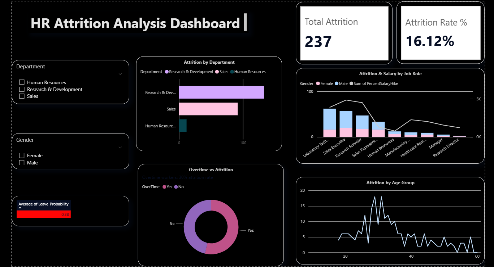

# HR Attrition Analysis — Why Employees Leave

## Problem Statement
IBM HR dataset of 1,470 employees — identify why employees leave and predict who will leave next.

## Tools Used
Python · Pandas · Seaborn · Scikit-learn · SQLite · Power BI

## Key Findings
- Overtime workers leave **3x more** (30% vs 10% attrition rate)
- Employees who left earned **₹2,000/month less** on average
- Sales Representatives have **40% attrition** — highest risk role
- New joiners (0–2 years) have **35% attrition** — early churn problem

## ML Model
Logistic Regression — **75% accuracy**, **77% recall** on leavers
Handled class imbalance using class_weight='balanced'

## Files
- `hr_attrition.ipynb` — Full analysis notebook
- `hr_clean.csv` — Cleaned dataset
- `hr_model_results.csv` — Model predictions with leave probability
- `dashboard_preview.png` — Power BI dashboard screenshot
